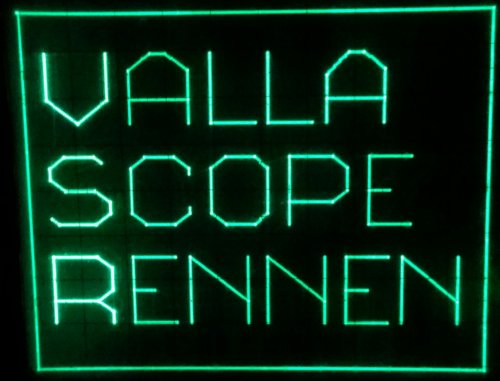
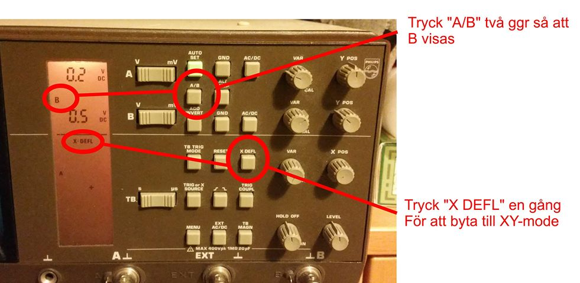
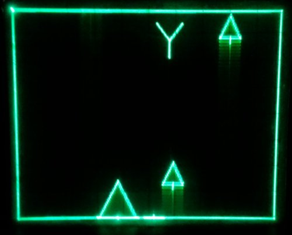
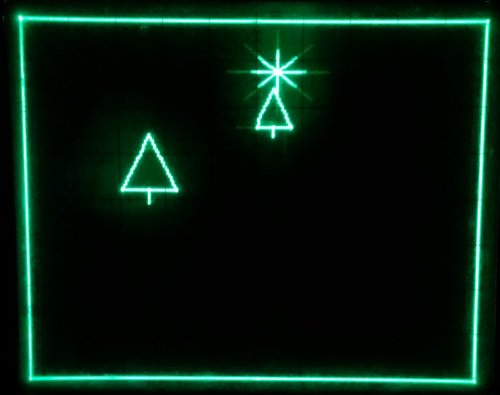
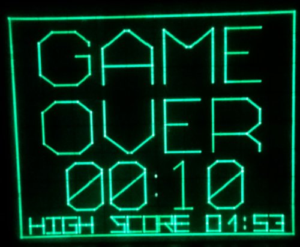
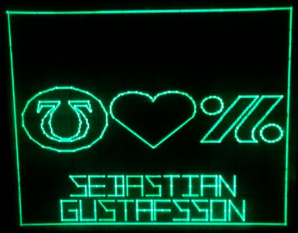

# Valla Scope Rennen

## Setup

Ställ in oscilloskopet på XY-mod, för labbets 50MHz PM3055 görs detta enligt nedan. 
X kopplas till ingång A och Y kopplas till ingång B.

## Actual in-game footage

## Credits

